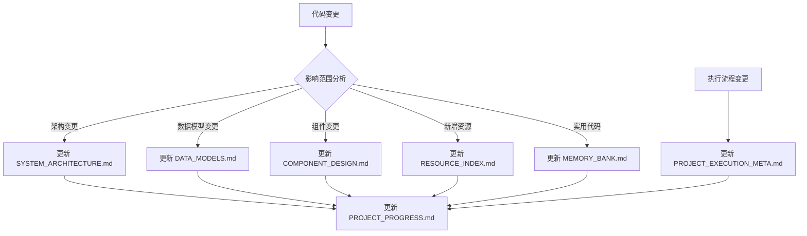
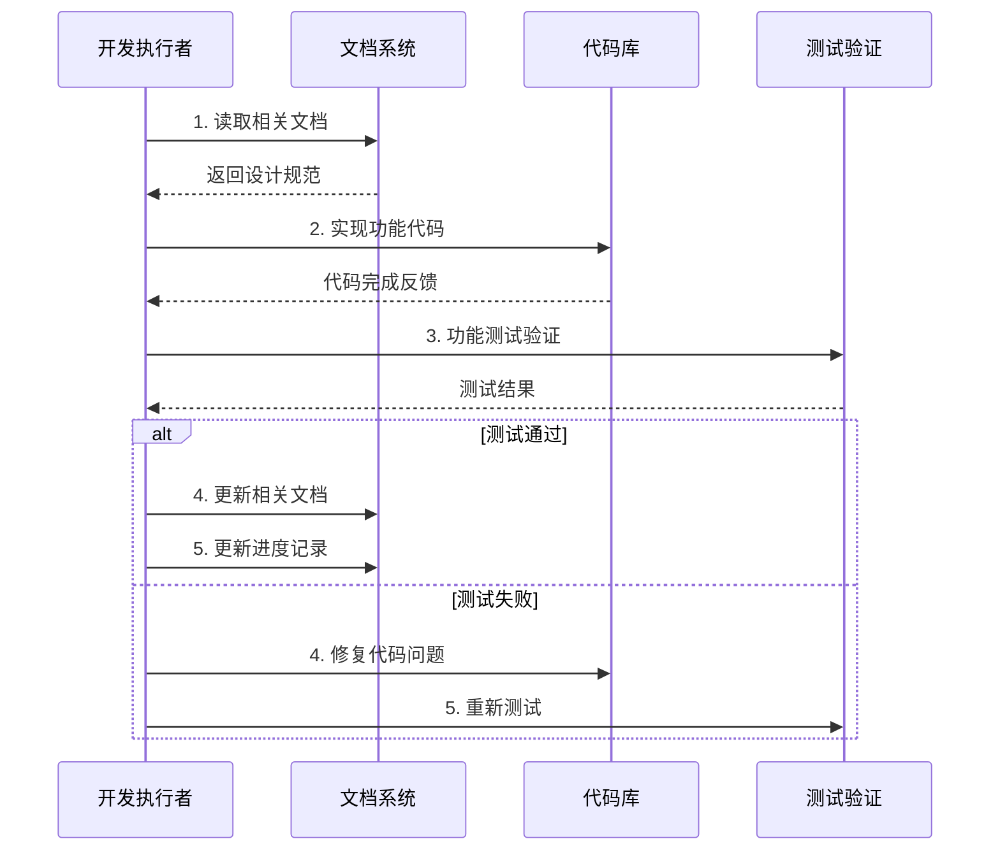
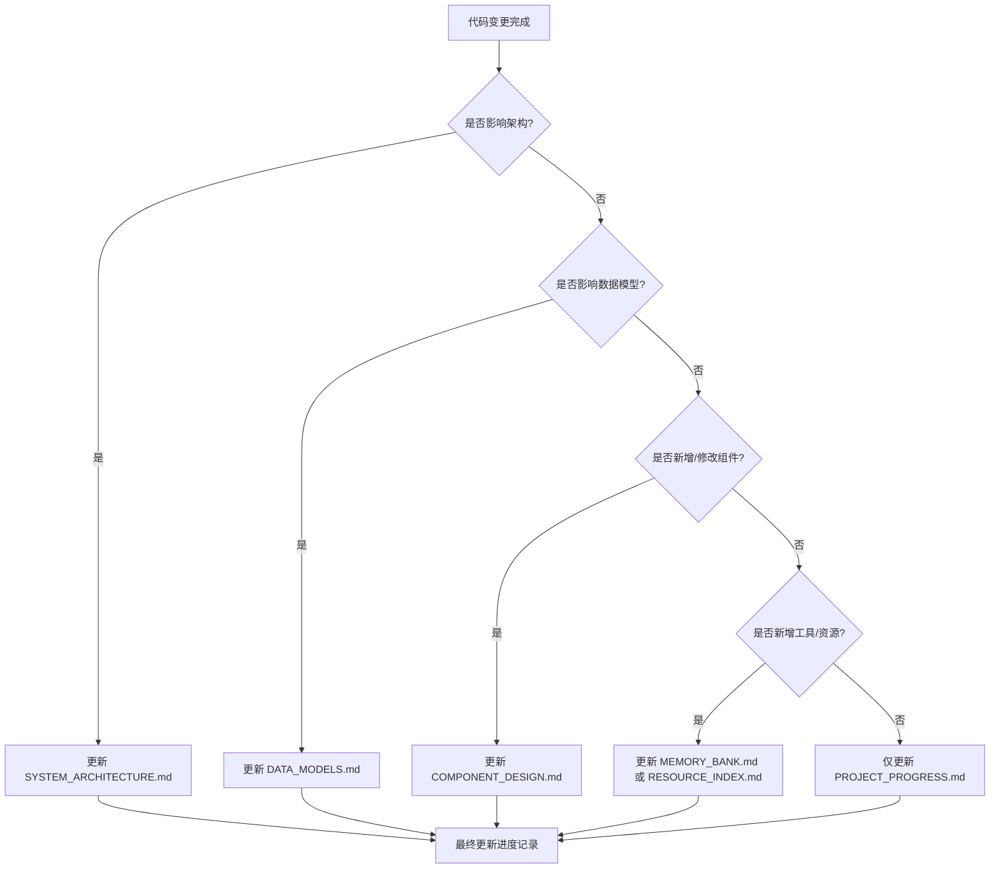

# OneStep 项目执行元逻辑

## 🧠 元逻辑概述

本文档定义了 OneStep 项目的执行元逻辑，即"如何管理项目本身"的规则和流程。它描述了项目执行过程中的决策机制、文档更新规则，以及如何根据任务执行情况动态调整项目策略。

---

## 📚 docs文件夹管理规则

### 文件职责分工

| 文件名 | 主要职责 | 更新触发条件 | 最小更新原则 |
|--------|----------|-------------|-------------|
| [`SYSTEM_ARCHITECTURE.md`](./SYSTEM_ARCHITECTURE.md) | 系统架构设计 | 架构变更、新模块设计 | 仅更新变更部分的架构图和接口定义 |
| [`DATA_MODELS.md`](./DATA_MODELS.md) | 数据模型规范 | 数据结构变更、新增字段 | 仅更新修改的数据类型和接口 |
| [`COMPONENT_DESIGN.md`](./COMPONENT_DESIGN.md) | UI组件设计规范 | 新组件设计、现有组件修改 | 仅更新新增或变更的组件规范 |
| [`RESOURCE_INDEX.md`](./RESOURCE_INDEX.md) | 项目资源索引 | 新增资源、路径变更 | 仅更新资源清单和链接 |
| [`MEMORY_BANK.md`](./MEMORY_BANK.md) | 快速开发参考 | 新增常用代码、工具函数 | 仅新增实用的代码片段和工具 |
| [`PROJECT_PROGRESS.md`](./PROJECT_PROGRESS.md) | 项目进度追踪 | 每日工作、里程碑完成 | 更新进度状态和工作日志 |
| [`PROJECT_EXECUTION_META.md`](./PROJECT_EXECUTION_META.md) | 执行元逻辑 | 流程优化、规则调整 | 仅修改执行规则和决策流程 |

### 文档同步更新规则



---

## 🔄 项目执行工作流

### 1. 任务读取和分析阶段

#### 文档读取优先级
```typescript
interface DocumentReadingPriority {
  phase1_core: [
    'RESOURCE_INDEX.md',      // 获得项目全貌
    'SYSTEM_ARCHITECTURE.md', // 理解架构设计
    'PROJECT_PROGRESS.md'     // 了解当前进度
  ];
  
  phase2_detail: [
    'DATA_MODELS.md',         // 数据结构细节
    'COMPONENT_DESIGN.md',    // UI组件规范
    'MEMORY_BANK.md'          // 开发参考
  ];
  
  phase3_context: [
    '../../../参考资料/*.md',  // 业务框架文档
    '../../@types/function/',  // 技术接口文档
  ];
}
```

#### 任务需求读取逻辑
1. **确定任务类型**
   - 新功能开发 → 读取架构和组件设计文档
   - Bug修复 → 重点关注相关模块文档
   - 文档更新 → 关注文档间的依赖关系
   - 性能优化 → 关注架构和数据流设计

2. **评估影响范围**
   - 单模块影响 → 局部文档更新
   - 跨模块影响 → 多文档协调更新
   - 架构级影响 → 核心设计文档重审

3. **制定执行计划**
   - 优先级排序：核心功能 > 扩展功能 > 优化功能
   - 依赖关系分析：确保前置条件满足
   - 风险评估：技术风险、时间风险、集成风险

### 2. 任务执行阶段

#### 开发执行流程


#### 代码实现指导原则
1. **最小化原则**: 只实现当前任务必需的功能
2. **一致性原则**: 遵循既定的架构和设计规范
3. **扩展性原则**: 为未来扩展留出合理的接口
4. **性能原则**: 关注关键路径的性能表现

### 3. 文档更新阶段

#### 更新判断决策树


#### 文档更新最小原则
- **精确定位**: 只更新实际变更的部分
- **保持版本**: 记录变更时间和版本信息
- **影响说明**: 简要说明变更对系统的影响
- **向前兼容**: 确保更新不影响现有功能
- **强调前瞻性**: 在更新文档时，应主动思考并阐明当前设计如何支持未来的功能扩展，以提升文档的长期价值和可维护性。

---

## 🎯 任务执行决策逻辑

### 优先级决策框架

#### 任务重要性矩阵
```
高影响 | 🔥 立即执行     | ⚡ 优先安排    |
      | (核心功能)      | (重要功能)     |
      |----------------|---------------|
低影响 | 📅 计划执行     | 🗂️ 积压处理   |
      | (支撑功能)      | (优化功能)     |
       低紧急          高紧急
```

#### 技术债务管理
1. **预防原则**: 设计阶段充分考虑，避免技术债务产生
2. **跟踪原则**: 明确记录技术债务和临时解决方案
3. **还债原则**: 在功能稳定后及时重构和优化
4. **平衡原则**: 在交付速度和代码质量间找到平衡

### 风险应对策略

#### 常见风险类型和应对方案
```typescript
interface RiskMitigation {
  technical_risks: {
    '酒馆助手API兼容性': {
      mitigation: '提前创建API适配层，确保向后兼容';
      fallback: '提供降级方案，支持基础功能';
      monitoring: '持续测试API调用和响应';
    };
    
    '页面性能问题': {
      mitigation: '实现懒加载和虚拟滚动';
      fallback: '分页加载和简化界面';
      monitoring: '性能监控和关键指标追踪';
    };
    
    '数据模型复杂性': {
      mitigation: '分层验证和渐进式验证';
      fallback: '基础验证和用户提示';
      monitoring: '数据完整性检查';
    };
  };
  
  project_risks: {
    '需求变更': {
      mitigation: '模块化设计，降低变更影响';
      fallback: '核心功能优先，扩展功能可选';
      monitoring: '需求变更影响评估';
    };
    
    '时间压力': {
      mitigation: 'MVP优先，分阶段交付';
      fallback: '核心功能先行，优化功能后续';
      monitoring: '进度里程碑跟踪';
    };
  };
}
```

---

## 📊 质量保证机制

### 代码质量检查清单

#### 开发阶段检查
- [ ] **功能完整性**: 所有必需功能均已实现
- [ ] **接口一致性**: 遵循既定的接口设计规范
- [ ] **错误处理**: 妥善处理异常情况和边界条件
- [ ] **性能考虑**: 关键路径性能满足要求
- [ ] **代码规范**: 遵循TypeScript和SCSS编码规范

#### 集成阶段检查
- [ ] **模块协调**: 各模块间接口调用正确
- [ ] **数据流验证**: 数据在各组件间正确传递
- [ ] **状态管理**: 应用状态变更逻辑正确
- [ ] **事件处理**: 用户交互和系统事件处理正常
- [ ] **酒馆集成**: 与酒馆助手API集成工作正常

#### 发布前检查
- [ ] **功能测试**: 所有功能在目标环境正常工作
- [ ] **兼容性测试**: 在不同浏览器和设备上正常显示
- [ ] **性能测试**: 页面加载和响应时间满足要求
- [ ] **压力测试**: 大数据量和复杂配置下稳定运行
- [ ] **文档同步**: 所有文档与实际代码保持同步

### 文档质量标准

#### 技术文档要求
- **准确性**: 描述与实际实现保持一致
- **完整性**: 覆盖所有关键概念和接口
- **可读性**: 结构清晰，易于理解和查找
- **时效性**: 及时更新，反映最新变更

#### 维护文档要求
- **追溯性**: 记录重要决策的原因和过程
- **操作性**: 提供清晰的操作指导和故障排除
- **学习性**: 为新开发者提供学习路径

---

## 🔧 工具和自动化

### 开发效率工具

#### 代码生成和模板
```typescript
interface DevelopmentTools {
  templates: {
    page_component: '页面组件模板';
    ui_component: 'UI组件模板';
    form_component: '表单组件模板';
    utility_function: '工具函数模板';
  };
  
  generators: {
    component_scaffold: '组件脚手架生成器';
    type_definition: '类型定义生成器';
    test_template: '测试模板生成器';
  };
  
  validators: {
    data_schema: '数据结构验证器';
    interface_check: '接口一致性检查';
    performance_monitor: '性能监控工具';
  };
}
```

#### 自动化流程
1. **代码检查**: 使用 TypeScript 编译器和 ESLint
2. **样式验证**: 使用 Stylelint 检查 SCSS 代码
3. **格式化**: 使用 Prettier 统一代码格式
4. **构建流程**: 使用 Webpack 进行代码打包和优化

### 监控和反馈

#### 开发过程监控
- **进度追踪**: 任务完成情况和时间消耗
- **质量指标**: 代码覆盖率和复杂度分析
- **性能监控**: 构建时间和运行时性能
- **错误跟踪**: 开发和测试阶段的错误统计

---

## 🚀 持续改进机制

### 经验总结和优化

#### 定期回顾机制
- **每日回顾**: 当天工作的完成情况和遇到的问题
- **周度回顾**: 一周内的进度和质量指标分析
- **里程碑回顾**: 每个阶段完成后的全面总结
- **项目复盘**: 项目完成后的全面分析和经验提取

#### 流程优化原则
1. **数据驱动**: 基于实际数据进行决策和优化
2. **渐进改进**: 小步快跑，持续优化
3. **反馈循环**: 建立快速反馈和调整机制
4. **知识积累**: 将经验和教训转化为可重用的知识

### 知识管理

#### 经验文档化
- **最佳实践**: 记录验证有效的开发模式
- **常见问题**: 整理常见问题和解决方案
- **工具使用**: 积累工具使用技巧和配置
- **调试技巧**: 记录调试和问题排查方法

---

## 📋 执行检查清单

### 任务开始前
- [ ] 确认任务目标和成功标准
- [ ] 阅读相关技术文档和设计规范
- [ ] 检查前置依赖和环境准备
- [ ] 制定详细的执行计划和时间安排

### 执行过程中
- [ ] 遵循既定的架构和设计原则
- [ ] 及时记录重要决策和问题解决方案
- [ ] 保持代码质量和规范一致性
- [ ] 定期验证功能和集成效果

### 任务完成后
- [ ] 完成功能测试和质量检查
- [ ] 更新相关文档和进度记录
- [ ] 提交代码变更和版本标记
- [ ] 总结经验教训和改进建议

---

*元逻辑文档版本: v1.1*
*最后更新: 2025-06-28*
*下次审查时间: 项目交付后*