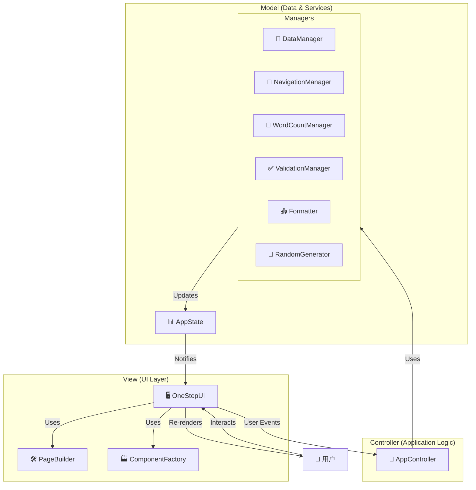
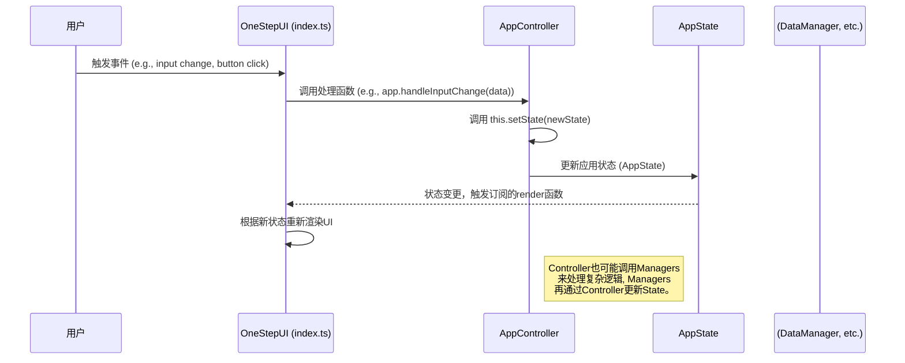

# OneStep 系统架构设计

## 🏗️ 整体系统架构

### 系统概览图


---

## 🗂️ 模块化架构设计

### 1. 核心应用层 (Core Application Layer)
```
src/OneStep/
├── index.html          # 主界面入口
├── index.scss          # 全局样式
├── index.ts            # 应用主入口和UI层
├── app/                # (Controller & Model)
│   ├── AppController.ts     # 中央控制器
│   ├── NavigationManager.ts # 导航逻辑
│   ├── WordCountManager.ts  # 字数统计
│   └── DataManager.ts       # 数据处理
└── view/               # (View)
    ├── PageBuilder.ts       # 页面构建逻辑
    └── ComponentFactory.ts  # UI组件工厂
```

### 2. 页面组件层 (Page Component Layer)
```
src/OneStep/pages/
├── needs/              # 页面1: 玩家需求
│   ├── NeedsPage.ts
│   ├── NeedsPage.scss
│   └── components/
├── world/              # 页面2: 世界观
│   ├── WorldPage.ts
│   ├── WorldPage.scss
│   └── components/
├── character/          # 页面3: 人物
├── plot/               # 页面4: 剧情
├── rules/              # 页面5: 规则
└── style/              # 页面6: 文风
```

### 3. 通用组件层 (Common Component Layer)
```
src/OneStep/components/
├── ui/                 # 基础UI组件
│   ├── Button/
│   ├── Input/
│   ├── Modal/
│   └── Tooltip/
├── form/               # 表单组件
│   ├── GradientSelector/
│   ├── PointsAllocator/
│   ├── TagSelector/
│   └── CustomTextInput/
└── business/           # 业务组件
    ├── PageIntro/
    ├── RandomGenerator/
    └── WordCountDisplay/
```

### 4. 工具服务层 (Utility Service Layer)
```
src/OneStep/utils/
├── api/                # API封装
│   ├── TavernHelper.ts
│   └── DataStorage.ts
├── validators/         # 数据验证
│   ├── FormValidator.ts
│   └── SchemaValidator.ts
├── generators/         # 随机生成
│   ├── RandomGenerator.ts
│   └── TemplateGenerator.ts
└── formatters/         # 数据格式化
    ├── JSONFormatter.ts
    └── ProfileFormatter.ts
```

---

## 🔄 数据流架构

### 主要数据流向 (单向数据流)


### 数据状态管理
```typescript
interface AppState {
  // 当前页面状态
  navigation: {
    currentPage: PageType;
    visitedPages: Set<PageType>;
    completionStatus: Record<PageType, boolean>;
  };
  
  // 表单数据状态
  formData: {
    needs: NeedsFormData;
    world: WorldFormData;
    character: CharacterFormData;
    plot: PlotFormData;
    rules: RulesFormData;
    style: StyleFormData;
  };
  
  // 计算状态
  computed: {
    wordCounts: Record<PageType, number>;
    totalWordCount: number;
    validationErrors: ValidationError[];
    completionPercentage: number;
  };
  
  // UI状态
  ui: {
    loading: boolean;
    showHelp: boolean;
    expandedSections: Set<string>;
    isDirty: boolean;
  };
}
```

---

## 🏛️ 技术架构决策

### 1. 架构模式选择
- **MVC模式**: 分离数据、视图和控制逻辑
- **组件化设计**: 可复用的独立组件
- **响应式数据流**: 单向数据流管理

### 2. 状态管理策略
```typescript
// AppController作为集中式状态管理器
export class AppController {
  private state: AppState;
  private subscribers: Set<(state: AppState) => void> = new Set();

  constructor() {
    this.state = this.data.load() || this.createInitialState();
  }

  // 状态更新: 所有状态变更的唯一入口
  public setState = (updates: Partial<AppState>): void => {
    // ... 更新逻辑 ...
    this.state.ui.isDirty = true;
    this.recomputeState(); // 计算衍生数据
    this.notify(); // 通知UI更新
  };

  // 状态订阅: UI层订阅状态变更
  public subscribe = (callback: (state: AppState) => void): (() => void) => {
    this.subscribers.add(callback);
    return () => this.subscribers.delete(callback);
  };

  // 通知: 触发所有订阅的回调
  private notify = (): void => {
    this.subscribers.forEach(callback => callback(this.state));
  };
}
```

### 3. 模块依赖关系
```
┌─────────────────┐
│   页面组件层     │
└─────────┬───────┘
          │ 依赖
┌─────────▼───────┐
│   通用组件层     │
└─────────┬───────┘
          │ 依赖
┌─────────▼───────┐
│   工具服务层     │
└─────────┬───────┘
          │ 依赖
┌─────────▼───────┐
│   酒馆助手API   │
└─────────────────┘
```

---

## 🔧 集成接口设计

### 1. 酒馆助手集成
```typescript
interface TavernIntegration {
  // 宏解析
  resolveMacro(macro: string): string;
  
  // 消息处理
  getCurrentContext(): ChatContext;
  
  // 指令发送
  sendCommand(command: string): Promise<void>;
  
  // 变量管理
  setVariable(key: string, value: any): void;
  getVariable(key: string): any;
}
```

### 2. 数据持久化
```typescript
interface DataPersistence {
  // 保存配置
  saveConfig(config: AppConfig): Promise<void>;
  
  // 加载配置
  loadConfig(): Promise<AppConfig | null>;
  
  // 导出数据
  exportData(): Promise<string>;
  
  // 导入数据
  importData(data: string): Promise<void>;
}
```

---

## 📊 性能和扩展性考虑

### 1. 性能优化策略
- **懒加载**: 页面组件按需加载
- **虚拟滚动**: 大列表的性能优化
- **防抖节流**: 输入事件的性能控制
- **缓存策略**: 计算结果和组件状态缓存

### 2. 扩展性设计
- **插件系统**: 支持自定义组件和页面
- **主题系统**: 可配置的样式主题
- **国际化**: 多语言支持框架
- **API抽象**: 可更换的后端集成

### 3. 容错和降级
```typescript
interface ErrorBoundary {
  // 错误捕获
  catchError(error: Error, errorInfo: ErrorInfo): void;
  
  // 降级策略
  fallbackToDefault(): void;
  
  // 错误恢复
  retryOperation(): Promise<void>;
}
```

---

## 🚀 部署和运行时架构

### 1. 构建流程


### 2. 运行时环境
- **宿主环境**: SillyTavern iframe
- **依赖库**: 全局jQuery、lodash等
- **内存管理**: 合理的组件生命周期
- **事件处理**: 防止内存泄漏

### 3. 监控和调试
```typescript
interface Monitoring {
  // 性能监控
  trackPerformance(metric: PerformanceMetric): void;
  
  // 错误追踪
  trackError(error: Error, context: ErrorContext): void;
  
  // 用户行为
  trackUserAction(action: UserAction): void;
}
```

---

## 📋 架构验证清单

### ✅ 设计原则检查
- [ ] 单一职责：每个模块职责清晰
- [ ] 开闭原则：易于扩展，修改影响最小
- [ ] 依赖倒置：依赖抽象而非具体实现
- [ ] 松耦合：模块间依赖关系清晰

### ✅ 质量属性验证
- [ ] 性能：页面响应时间 < 200ms
- [ ] 可用性：用户操作简单直观
- [ ] 可维护性：代码结构清晰，易于理解
- [ ] 可扩展性：支持新页面和组件扩展

---

## 🏛️ 架构的可扩展性设计

本架构在设计时充分考虑了未来的可扩展性，使其能够轻松地适应新功能、新页面或更复杂的逻辑。

### 范例：如何添加一个新页面

假设我们需要在“文风”之后添加一个新的页面——“环境设定 (Environment)”。通过以下步骤即可完成扩展：

1.  **类型定义 (`types/AppTypes.ts`)**:
    *   在 `PageType` 类型中增加 `'environment'`。

2.  **数据模型 (`docs/DATA_MODELS.md` & `types/AppTypes.ts`)**:
    *   在文档中定义 `EnvironmentFormData` 的数据结构。
    *   在 `AppTypes.ts` 中创建 `EnvironmentFormData` 接口。
    *   在 `AppState['formData']` 中添加 `environment: EnvironmentFormData`。

3.  **页面构建 (`view/PageBuilder.ts`)**:
    *   在 `buildPage` 方法中增加一个 `case 'environment':`，调用 `ComponentFactory` 来构建新页面的表单元素。

4.  **导航管理 (`app/NavigationManager.ts`)**:
    *   在页面顺序数组 `pageOrder` 中加入 `'environment'`，新页面即会自动纳入导航流程。

5.  **状态管理 (`app/DataManager.ts`)**:
    *   在初始状态 `initialState` 中为 `environment` 提供默认数据。

通过以上步骤，一个功能完整的新页面就被无缝地集成到了应用中。这得益于**高度模块化**和**数据驱动**的设计思想：UI渲染、导航逻辑和状态管理都依赖于集中的数据模型和配置，而非硬编码，从而实现了极高的可扩展性。

---
*架构文档版本: v1.2*
*最后更新: 2025-06-28*