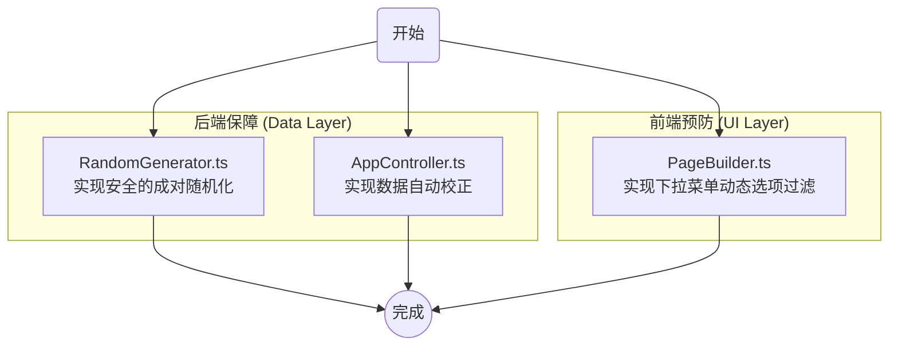

# 世界观范围选择器（Min/Max）逻辑修复方案

本文档旨在详细说明解决“世界观”页面中“最低/最高水平”选择器逻辑问题的完整编码方案。

## 1. 问题概述

在“世界观”配置页面中，存在多个模块包含成对的等级范围选择器（例如，“力量与超凡”的最高/最低水平）。当前实现中，这两个选择器相互独立，导致可能出现“最低水平”高于“最高水平”的不合逻辑情况。此问题同时影响用户手动设置和随机生成功能。

**受影响的模块:**
- 力量与超凡 (magic)
- 技术与造物 (technology)
- 势力与组织 (factions)
- 经济与资源 (economy)
- 文化与习俗 (culture)
- 性爱与情欲 (desire)

## 2. 解决方案架构

我们将采用“后端保障”与“前端预防”相结合的策略，确保数据模型的健壮性和用户体验的流畅性。



## 3. 编码实施步骤

### 第 1 步: 修复随机化逻辑 (`RandomGenerator.ts`)

**目标**: 创建一个专门的方法来随机生成一对有效的 `min/max` 值。

**文件**: `src/OneStep/app/RandomGenerator.ts`

1.  **新增 `randomizeMinMax` 方法**:
    ```typescript
    /**
     * 从选项列表中随机生成一对有效的 min 和 max 值。
     * @param options - 包含 value 和 label 的选项数组。
     * @returns 一个对象 { min: string, max: string }，确保 min <= max。
     */
    public randomizeMinMax(options: GradientOption[]): { min: string; max: string } {
      // 过滤掉空白选项
      const validOptions = options.filter(opt => opt.value && opt.value !== '0');
      if (validOptions.length < 2) {
        const val = validOptions[0]?.value || '1';
        return { min: val, max: val };
      }

      // 随机抽取两个不同的索引
      let index1 = Math.floor(Math.random() * validOptions.length);
      let index2 = Math.floor(Math.random() * validOptions.length);
      while (index1 === index2) {
        index2 = Math.floor(Math.random() * validOptions.length);
      }

      const val1 = parseInt(validOptions[index1].value, 10);
      const val2 = parseInt(validOptions[index2].value, 10);

      return {
        min: String(Math.min(val1, val2)),
        max: String(Math.max(val1, val2)),
      };
    }
    ```

2.  **修改 `randomizeWorldviewPage` 方法**:
    在 `AppController.ts` 或调用随机化的地方，找到处理世界观随机化的逻辑，并使用新方法。
    ```typescript
    // 伪代码 - 在 AppController.ts 的 randomizeCurrentPage 中
    if (currentPage === 'world') {
        const moduleData = this.state.formData.world.modules[moduleId];
        // ...
        const techLevels = TECH_LEVELS; // 从 constants 导入
        const { min, max } = this.randomizer.randomizeMinMax(techLevels);
        moduleData.macro_selections['tech_axis_min'] = min;
        moduleData.macro_selections['tech_axis_max'] = max;
        // 对其他所有受影响的模块重复此操作
        // ...
    }
    ```

### 第 2 步: 实现数据自动校正 (`AppController.ts`)

**目标**: 当用户更新 `min` 或 `max` 值时，自动校正另一个值以维持逻辑。

**文件**: `src/OneStep/app/AppController.ts`

1.  **在 `updateFormData` 方法中添加处理逻辑**:
    ```typescript
    public updateFormData = (page: PageType, field: string, value: any): void => {
        // ... (现有逻辑)

        if (page === 'world' && field.startsWith('modules.')) {
            this.handleWorldviewRangeUpdate(field, value);
        }

        // ... (现有逻辑)
        this.recalculateState();
    };
    ```

2.  **新增 `handleWorldviewRangeUpdate` 辅助方法**:
    ```typescript
    private handleWorldviewRangeUpdate(field: string, value: any): void {
        const parts = field.split('.');
        // field 格式: modules.magic.macro_selections.supernatural_axis_max
        if (parts.length !== 4 || parts[2] !== 'macro_selections') return;

        const moduleId = parts[1];
        const fieldKey = parts[3];

        let minKey: string | null = null;
        let maxKey: string | null = null;
        
        if (fieldKey.endsWith('_min')) {
            minKey = fieldKey;
            maxKey = fieldKey.replace('_min', '_max');
        } else if (fieldKey.endsWith('_max')) {
            maxKey = fieldKey;
            minKey = fieldKey.replace('_max', '_min');
        } else {
            return; // 不是 min/max 字段
        }

        const moduleState = this.state.formData.world.modules[moduleId];
        if (!moduleState || !moduleState.macro_selections.hasOwnProperty(minKey)) {
            return; // 另一个字段不存在
        }

        const currentMin = parseInt(fieldKey.endsWith('_min') ? value : moduleState.macro_selections[minKey], 10);
        const currentMax = parseInt(fieldKey.endsWith('_max') ? value : moduleState.macro_selections[maxKey], 10);

        if (currentMin > currentMax) {
            // 如果更新的是 min 且大于 max，则将 max 设为 min
            if (fieldKey.endsWith('_min')) {
                moduleState.macro_selections[maxKey] = String(currentMin);
            }
            // 如果更新的是 max 且小于 min，则将 min 设为 max
            else {
                moduleState.macro_selections[minKey] = String(currentMax);
            }
        }
    }
    ```

### 第 3 步: 实现 UI 动态过滤 (`PageBuilder.ts`)

**目标**: 在渲染下拉菜单时，根据配对的另一个值过滤可选项。

**文件**: `src/OneStep/view/PageBuilder.ts`

1.  **修改 `buildWorldviewCard` 方法**:
    ```typescript
    // 在 buildWorldviewCard 方法内部，处理 macroOptions 的循环中
    moduleInfo.macroOptions.forEach((option: any) => {
        const fieldPath = `modules.${moduleInfo.id}.macro_selections.${option.id}`;
        const value = moduleState.macro_selections[option.id];

        if (option.type === 'dropdown') {
            let filteredOptions = option.options;
            const fieldKey = option.id;

            // 检查是否是 min/max 字段
            if (fieldKey.endsWith('_min') || fieldKey.endsWith('_max')) {
                const isMin = fieldKey.endsWith('_min');
                const pairKey = isMin ? fieldKey.replace('_min', '_max') : fieldKey.replace('_max', '_min');
                const pairValue = moduleState.macro_selections[pairKey];

                if (pairValue) {
                    const boundary = parseInt(pairValue, 10);
                    filteredOptions = option.options.filter((opt: any) => {
                        if (!opt.value || opt.value === '0') return true; // 保留空白选项
                        const optValue = parseInt(opt.value, 10);
                        return isMin ? optValue <= boundary : optValue >= boundary;
                    });
                }
            }

            macroContainer.appendChild(
                componentFactory.dropdownSelector({
                    page: 'world',
                    field: fieldPath,
                    label: option.label,
                    value: value,
                    options: filteredOptions.map((o: any) => ({
                        ...o,
                        value: o.value,
                        description: o.description || '',
                    })),
                }),
            );
        } else {
            // ... 处理其他类型的组件
        }
    });
    ```

## 4. 总结

通过以上三个步骤的修改，可以从数据生成、状态管理和用户界面三个层面彻底解决 `min/max` 范围选择器的逻辑问题，确保数据的一致性和健壮性。